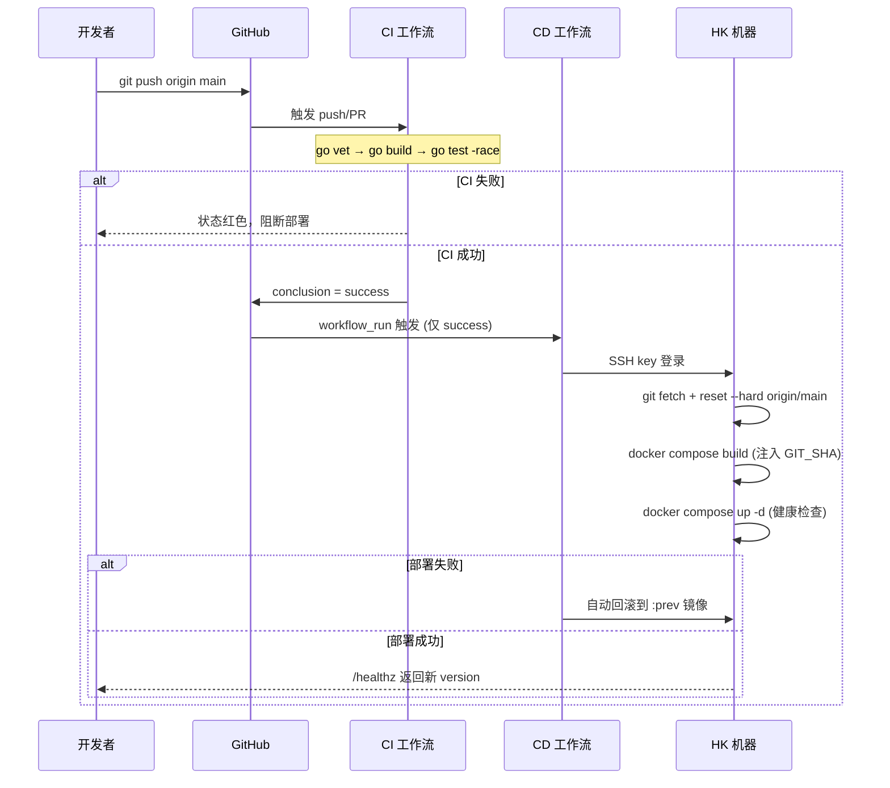

# BountyApp 开发-部署架构与 CI/CD 流程

> 代码唯一可信源 = GitHub `dannamax/tone`。本地只开发并 `git push`，HK 机器始终从 GitHub 拉取部署。

---

## 1. 开发-部署架构图

```mermaid
flowchart TB
    subgraph DEV["本地开发 (Mac)"]
        MAC["开发者终端"]
        IOS_SIM["iOS 模拟器 → 127.0.0.1:8080"]
        GO_RUN["go run ./cmd/server\n(本地 8080, SQLite+memory)"]
    end

    MAC -->|git push origin main| GH

    subgraph GH["GitHub: dannamax/tone (唯一可信源)"]
        REPO["main 分支"]
        CI[".github/workflows/ci.yml\n质量门禁"]
        CD[".github/workflows/cd.yml\n部署编排"]
    end

    REPO --> CI
    CI -->|workflow_run (success)| CD

    subgraph HK["腾讯云 HK CVM (129.226.138.231)"]
        SSH["GitHub Actions\nSSH key 登录 (HK_SSH_KEY)"]
        GITOP["git reset --hard origin/main\n(只读 deploy key 拉取)"]
        COMPOSE["docker compose\n-f deploy/docker-compose.prod.yml"]
        APP["容器 bountyapp\nGo :8080\nSQLite(volume) + /healthz"]
        REDIS["容器 redis\n验证码共享"]
        VOL["持久化 volume\nappdata (SQLite) / uploads"]
    end

    CD -->|SSH 触发| SSH
    SSH --> GITOP --> COMPOSE --> APP
    COMPOSE --> REDIS
    APP -.读写.-> VOL

    subgraph PROD["线上用户"]
        IPHONE["iPhone 真机\nhttps://129.226.138.231:8080"]
    end

    IPHONE -->|HTTPS| APP
```

**关键设计**
- **代码单一来源**：HK 机器是 GitHub 的 clone（只读 deploy key），CI 通过后 CD 才 `git pull` + 构建，未 `push` 的代码绝不上生产。
- **数据持久化**：SQLite 与 uploads 挂 `named volume`，重建容器不丢数据。
- **配置分离**：`.env` 由 HK 机器本地维护，不被 CI/部署脚本覆盖。
- **版本可核对**：编译注入 `GIT_SHA` → `/healthz` 返回 `version`，随时比对线上 commit。

---

## 2. CI/CD 流程图



---

## 3. 本地手动部署入口

不依赖 Actions 时也可手动触发（等价行为，仍从 GitHub 拉取）：

```bash
./scripts/deploy.sh              # 校验已 push 后触发 HK 拉取部署
./scripts/deploy.sh status       # 查看容器 + 版本
./scripts/deploy.sh logs         # 跟随日志
./scripts/deploy.sh rollback     # 回滚到 :prev
```

部署后验证：

```bash
./scripts/e2e-smoke.sh http://129.226.138.231:8080
```

---

## 4. 组件清单

| 组件 | 位置 | 职责 |
|------|------|------|
| `backend/` | 仓库 | Go + Gin 后端，SQLite/Redis |
| `ios/` | 仓库 | SwiftUI 客户端 |
| `.github/workflows/ci.yml` | 仓库 | 质量门禁（vet/build/test） |
| `.github/workflows/cd.yml` | 仓库 | 部署编排（SSH + compose） |
| `deploy/docker-compose.prod.yml` | 仓库 | 生产 compose（volume / GIT_SHA） |
| `scripts/deploy-remote.sh` | 仓库 | HK 侧部署脚本（从 GitHub 拉取） |
| `scripts/deploy.sh` | 仓库 | 本地手动部署入口 |
| `scripts/e2e-smoke.sh` | 仓库 | 部署后端到端冒烟 |
| `/opt/bountyapp` | HK | git clone + `.env` 本地配置 |
| GitHub Secrets | GitHub | `HK_HOST`/`HK_USER`/`HK_SSH_KEY`/`HK_DEPLOY_DIR`/`HK_PORT` |
| Deploy key | HK `~/.ssh` | 只读拉取 GitHub 代码 |
