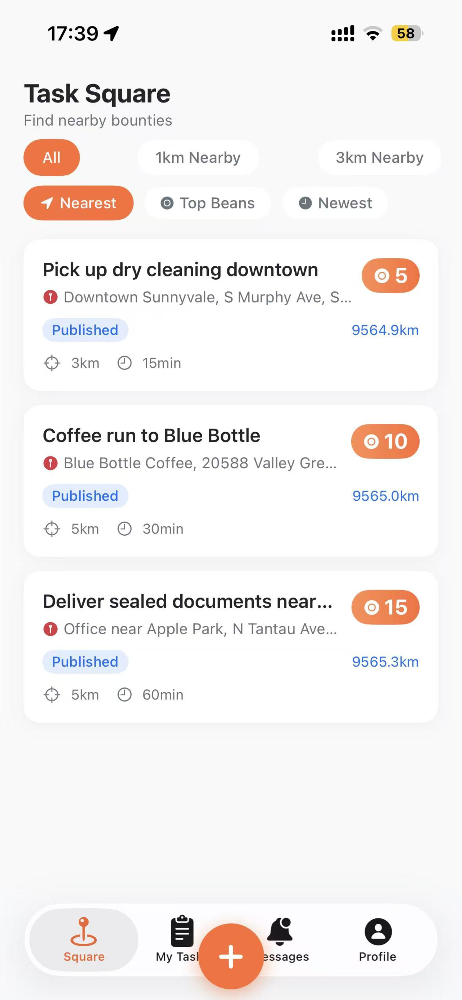
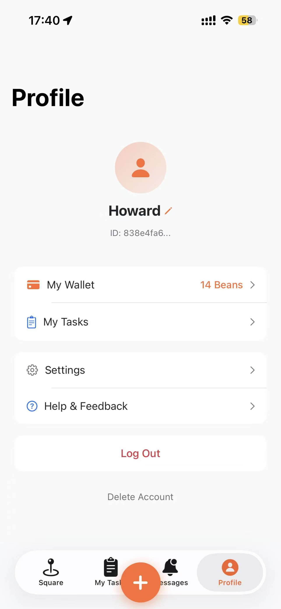
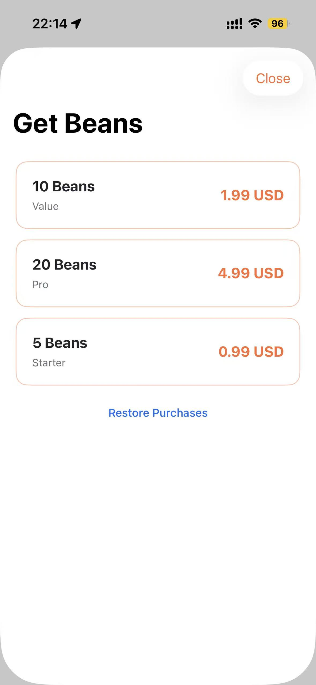

<p align="center">
  
</p>

<h1 align="center">SeekerHub</h1>

<p align="center">
  <b>Post a task near you. A hunter nearby gets it done.</b><br/>
  A location-based bounty marketplace for hyper-local errands — built with SwiftUI + Go.
</p>

<p align="center">
  
  
  
  
  
</p>

---

## What is SeekerHub?

SeekerHub turns your neighborhood into a marketplace of small jobs:

- **Post a task** — describe what you need, stake a bean bounty, drop a pin on the map.
- **Claim nearby work** — hunters within the task's radius see it instantly and claim.
- **Prove it's done** — photo evidence + GPS, validated server-side against the task's geo-fence.
- **Get paid in Beans** — when the poster confirms, bounty beans land in the hunter's wallet.

Same account, two roles: everyone can be a **Publisher** and a **Hunter**. The beans circulate inside the community — earned beans can be spent posting your own tasks.

| Task Square | Wallet | Get Beans |
|---|---|---|
|  |  |  |

## Feature Highlights

- **Geo-fenced bounty tasks** — publish within 1/3/5/10 km radius, 5–120 min deadlines, bounty 5–50 beans. Claiming *and* submitting are both validated against the task's radius.
- **Beans economy** — dual-ledger wallet (`purchased` / `earned`), atomic spend order (purchased beans first), full transaction history, refund-safe.
- **Real In-App Purchases** — StoreKit 2 consumables, Apple JWS verified locally against the Apple Root CA chain, idempotent by `transaction_id`. Three SKUs: $0.99 / $1.99 / $4.99.
- **Trust chain** — up to 3 evidence photos (MIME + magic-byte validated), GPS-stamped submissions, publisher confirmation, dispute arbitration, 24h auto-confirm.
- **In-task chat** — WebSocket realtime, image messages restricted to platform storage, URLs blocked in text (anti-phishing).
- **Live notifications** — 7 business events wired to both in-app center and APNs (token-based .p8, production gateway).
- **Privacy first** — GDPR consent flow, account deletion, `PrivacyInfo.xcprivacy` with valid *Required Reason API* declarations, no tracking.

## Beans Economy

| Package | Price | Beans | Product ID |
|---|---|---|---|
| Starter | $0.99 | 5 | `pkg_usd_2` |
| Value | $1.99 | 10 | `pkg_usd_5` |
| Pro | $4.99 | 20 | `pkg_usd_10` |
| Welcome gift | free | 5 | signup bonus |

Consumable IAPs only (App Store Guideline 3.1.1). Beans are task stakes — **not currency, not withdrawable, not transferable**. The platform never holds user funds; V2 plans Stripe Connect for a real-money escrow split.

## Architecture

```
iOS App (SwiftUI, StoreKit 2, APNs)
        │  HTTPS / WSS
        ▼
Go backend (Gin) — Tencent Cloud HK (Docker Compose)
  ├─ SQLite (users / tasks / transactions)  +  Redis (auth codes)
  ├─ Tencent COS object storage (evidence photos)
  ├─ Resend (verification-code email)
  └─ WebSocket hub (live chat + notifications)
        ▲
GitHub main ──► CI (vet/build/test) ──► CD to HK (version-checked, auto-rollback)
```

The deployed binary embeds its own git SHA, exposed at `/healthz` — every deploy is verified version-by-version, and failed deploys auto-rollback to the previous image.

## Repository Layout

```
backend/        Go API server (Gin), migrations, IAP verification, APNs client
ios/            SwiftUI app (BountyApp), StoreKit 2 purchase flow, UI tests
scripts/        e2e suites (61 checks), review-data tooling, deploy helpers
deploy/         docker-compose.prod.yml (app + redis + caddy)
docs/           screenshots used across docs & pitch deck
PRD.md          full product design document (Chinese)
ARCHITECTURE.md engineering deep-dive
TODO.md         prioritized backlog (P0 blockers / P1 / P2)
RELEASE.md      release & submission runbook
```

## Quick Start

### Backend

```bash
cd backend
go build ./cmd/server && ./server     # listens on :8080, /healthz exposes git SHA
# optional env: SERVER_PORT, DB_NAME, EMAIL_PROVIDER=mock|resend|smtp,
#               ENABLE_DEV_WALLET_ROUTES=true (local e2e only, mints fake balance)
```

### iOS

```bash
open ios/BountyApp/SeekerHub.xcodeproj
# Scheme: Seeker → Run on a simulator.
# Set your backend host in-app: Profile → Settings, or let auto-discovery find it.
```

> IAP purchases only work on real devices with an App Store Connect sandbox account, and require the three SKUs configured in ASC (`pkg_usd_2/5/10`).

## Testing

- **End-to-end (61 checks, green)** — `scripts/full-e2e.sh` against a running deployment: auth, publish, claim, geo-fence submit, confirm, dispute/refund, beans conservation assertions, forged-JWS rejection, restore purchase, task edit/delete.
- **UI tests** — `ios/SeekerUITests`: login → publish → my tasks → messages, plus a mock-backend smoke suite.
- **Unit** — Go tests incl. Apple JWS verification with a locally generated Apple-style cert chain.

```bash
cd backend && go test ./...
```

## Deployment (HK)

Pushes to `main` trigger CI + CD automatically: docker build (apk via Tencent mirror, CGO for go-sqlite3), image tagged `bountyapp:<full-sha>`, compose up with healthz version assertion, auto-rollback on failure.

```bash
# manual rebuild (must pin GIT_SHA — bare `up -d` falls back to the stale :latest tag)
GIT_SHA=$(git rev-parse HEAD) docker compose -f deploy/docker-compose.prod.yml up -d --build
```

Public endpoint: `https://api.gotseeker.com` (Let's Encrypt, served by Caddy).

## Compliance Notes

- Consumable IAPs only; beans are stakes, not currency (no withdrawal/transfer promises anywhere in the product).
- GDPR: first-launch consent (non-skippable), in-app Privacy Policy / Terms, account deletion with 30-day purge.
- Required Reason APIs declared in `PrivacyInfo.xcprivacy` (UserDefaults, `CA92.1`); location/camera covered by usage descriptions.
- Mock recharge/withdraw routes exist **only** behind `ENABLE_DEV_WALLET_ROUTES=true` — production returns 404.

## Roadmap

| Phase | Theme |
|---|---|
| **V1.0 (in App Store review)** | Global English launch — full beans economy, geo-fenced tasks, evidence & disputes, chat, APNs |
| V1.1 | Content moderation, analytics, rewards center (earned-bean redemption) |
| V1.2 | Ratings & reputation, hunter levels, referral beans |
| V2.0 | Real-money escrow via Stripe Connect (HK entity), beans become posting stakes |

## License

All rights reserved © 2026 SeekerHub. Contact: `songheng4744@163.com` · [gotseeker.com](https://gotseeker.com)
